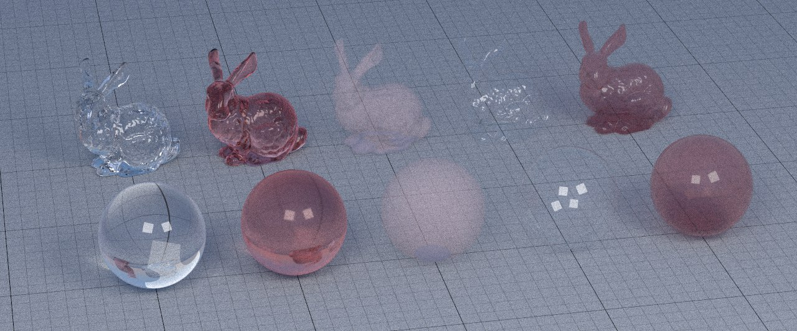

# ComputerGraphics

AIRO course of Fundamentals for Computer Graphics:

Three homeworks (Raytracing, to do, to do) and final project (to do).

Tools we used: C++, Visual Studio Code, CMake, gcc and ninja.

# Raytracing
First part: implement images with own colors, textures... as we can see here:

Second part: implementn of raytracing shader, with refraction for non-thin materials.
.jpg)

Third part: implement previous images with a cartoon shader.

.

# Pathtracing
First part: implement naive pathtracing and refraction

Second part: implement the pathtrace with lights

Third part: creation of personal scenes to render 
 

Fourt part: test the pathtrace on large scenes to see the effects of the lights

# Volumetric Pathtracing and HairShading
