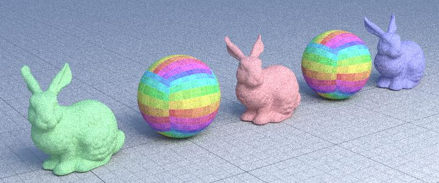

# Computer Graphics 

AIRO course of Fundamentals for Computer Graphics:

Three homeworks (Raytracing, Pathtracing, Volumetric Pathtracing) and the Hair Shading final extrapoint.

Tools I used: C++, Visual Studio Code, CMake, gcc and ninja.

NB: The "OwnScene" task is accomplished with the use of Blender software: in particular objects are imported, modeled and finally exported as ply files; then they are inserted in the YoctoGL scene structure, characterized by json files that recall ply and texture (jpg) files.

## Raytracing
In 3D computer graphics, ray tracing is a rendering technique for generating an image by tracing the path of light as pixels in an image plane and simulating the effects of its encounters with virtual objects. The technique is capable of producing a high degree of visual realism, more so than typical scanline rendering methods, but at a greater computational cost. This makes ray tracing best suited for applications where taking a relatively long time to render can be tolerated, such as in still computer-generated images, and film and television visual effects (VFX), but generally more poorly suited to real-time applications such as video games, where speed is critical in rendering each frame. Ray tracing is capable of simulating a variety of optical effects, such as reflection and refraction, scattering, and dispersion phenomena (such as chromatic aberration).

First part: basic implementation for images with own colors, textures evalation, camera ecc... as following:

Second part: implement the raytracing shader, with refraction for non-thin materials.

.jpg)

Third part: implement previous images with a cartoon shader.

.

## Pathtracing
Path tracing is a Monte Carlo method of rendering images of three-dimensional scenes such that the global illumination is faithful to reality. Fundamentally, the algorithm is integrating over all the illuminance arriving to a single point on the surface of an object. This illuminance is then reduced by a surface reflectance function (BRDF) to determine how much of it will go towards the viewpoint camera. This integration procedure is repeated for every pixel in the output image. When combined with physically accurate models of surfaces, accurate models of real light sources (light bulbs), and optically correct cameras, path tracing can produce still images that are indistinguishable from photographs.

First part: implement naive pathtracing and refraction

Second part: implement the pathtrace with lights

Third part: creation of personal scenes to render 

 

Fourt part: test the pathtrace on large scenes to see the effects of the lights

## Volumetric pathtracing 
Volumetric path tracing method enhances the rendering of the lighting in a scene by extending the path tracing method with the effect of light scattering. It is used for photorealistic effects of participating media like fire, explosions, smoke, clouds, fog or soft shadows. Like in the path tracing method, a ray gets followed backwards, beginning from the eye, until reaching the light source. In volumetric path tracing, scattering events can occur alongside with ray tracing. When a light ray hits a surface, a certain amount gets scattered into the media.

The work includes an implementation of the Catmull-Clark subdivision surface algorithm, a normal_mapping method and the shader volpath, modifying the previous path shader, as described in the slides. I obtained the following results:

## Hair shading (BSDF for a more realistic-looking hairs)
This section is well described in the report.pdf 

some results are showed following:

